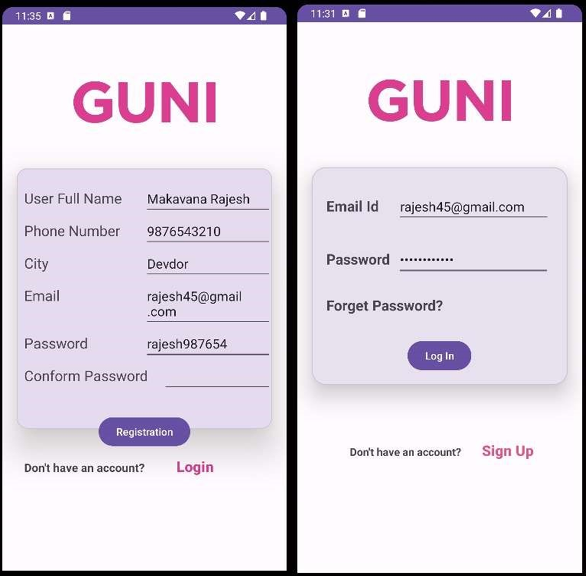

# MAD_P_4_21012011045
## AIM: 

 Create given UI by using ConstraintLayout, LinearLayout, in one android Application. 
 Create two activities LoginActivity by using ConstraintLayout and RegistrationActivity by using LinearLayout & use Explicit Intent to move from one activity to another activity.

## Screenshot

